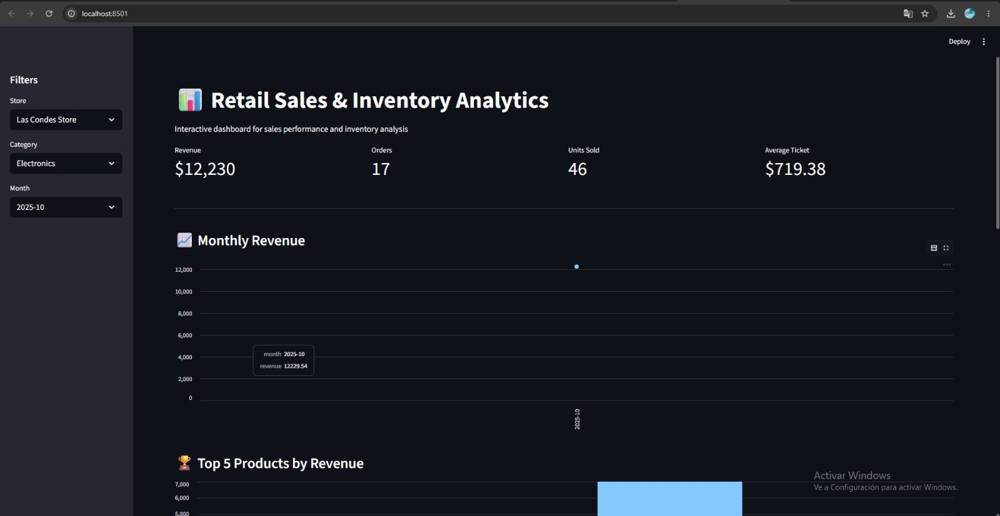
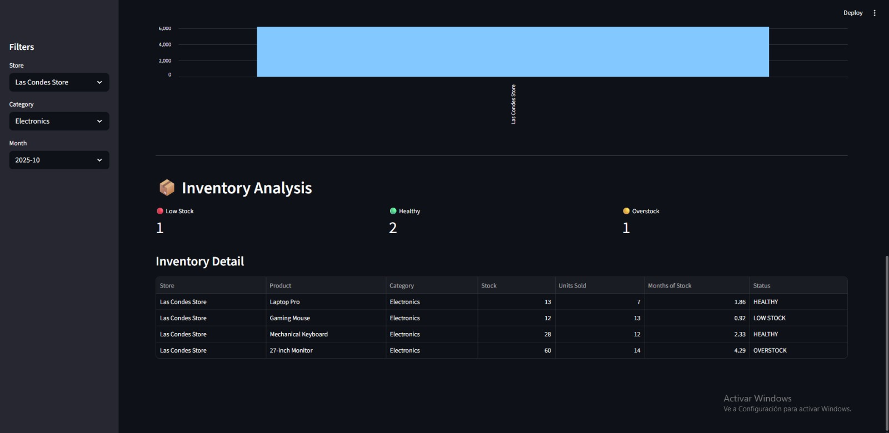

# Retail Sales & Inventory Analytics System

A data-driven retail analytics application built with Python and SQL to analyze sales performance, inventory levels, and business KPIs.

## Project Overview

This project simulates a retail company with multiple stores, products, customers, inventory, and sales transactions.

The system stores transactional data in a relational SQL database and provides analytics to support business decision-making.

## Dashboard Preview

## Key Features

- Sales and inventory database using SQLite
- 1,500 simulated retail transactions
- Revenue, orders, units sold, and average ticket KPIs
- Monthly sales and growth analysis
- Product, category, and store performance rankings
- Inventory analysis with:
  - Low Stock
  - Healthy Stock
  - Overstock
- Interactive Streamlit dashboard
- Filters by store, category, and month
- REST API built with FastAPI
- Automated API tests with Pytest

## Technologies

- Python
- SQL / SQLite
- Pandas
- Streamlit
- FastAPI
- Pytest
- Git / GitHub

## Business Questions Answered

The project helps answer questions such as:

- Which stores generate the most revenue?
- Which products and categories perform best?
- How are sales changing month over month?
- Which products are at risk of running out of stock?
- Which products may be overstocked?
- What is the company's average ticket?

## API

The FastAPI backend provides endpoints such as:

- `GET /`
- `GET /kpis`
- `GET /products`

## Testing

Automated tests validate the main API endpoints using Pytest.

## Author

Diego López  
Industrial Engineer